# Deep Image Homography Estimation
This project is the unofficial implementation of the paper [Deep Image Homography Estimation](https://arxiv.org/abs/1606.03798).
A homography is a mapping from a projective space (image) P to Q. From this network, it will estimate 
a `4-point homography parameterization which maps the four corners from one image into the second image`.

An example        |  Result | Patch | GroundTr | Predicted
:-------------------------:|:-------------------------:|:-------------------------:|:-------------------------:|:-------------------------:
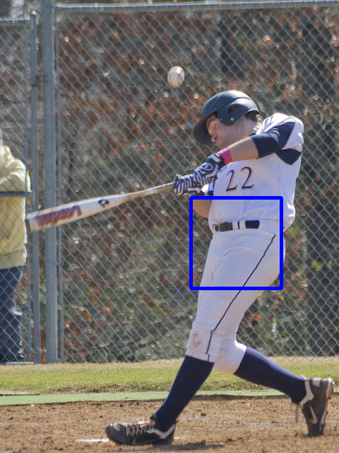   |   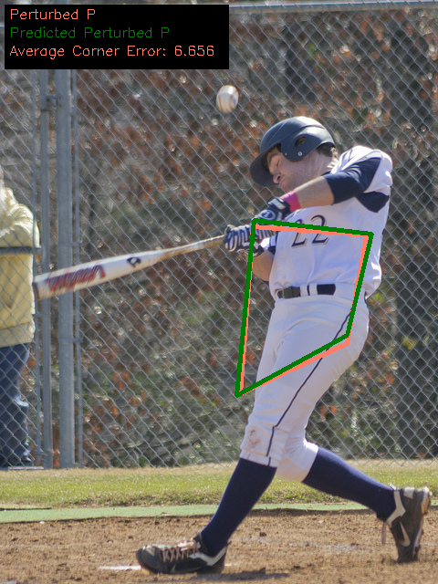 |  | 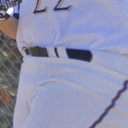| 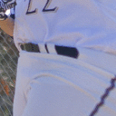
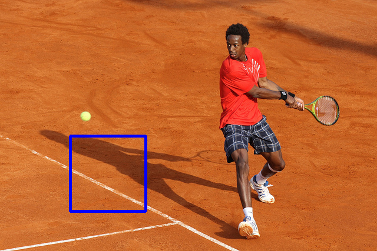   |   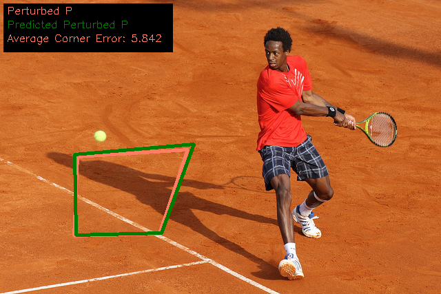 |  | | 
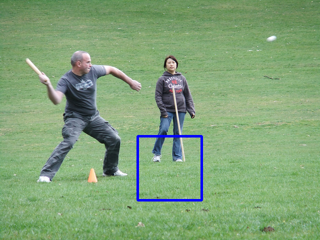   |   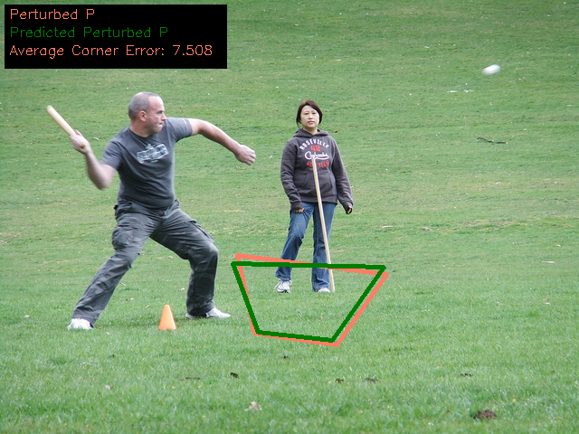 |  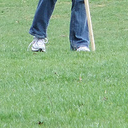| | 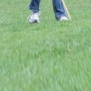
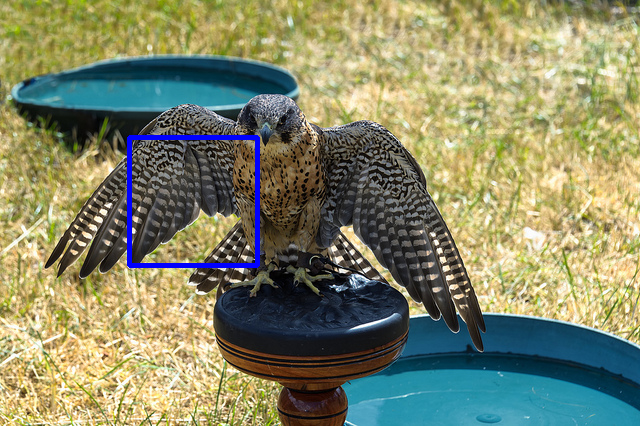   |   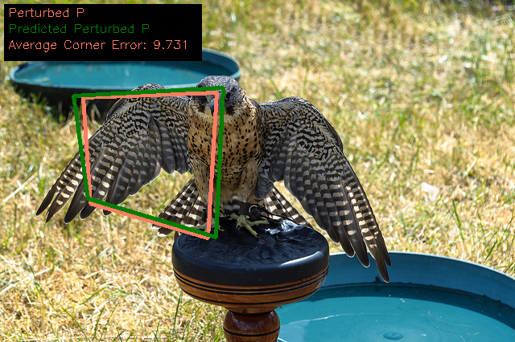 |  | | 
   |   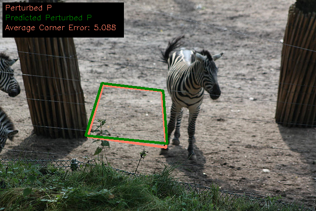 |  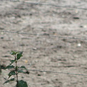| | 
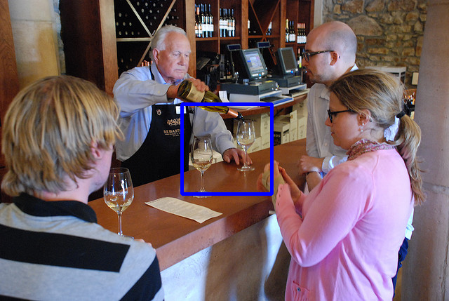   |   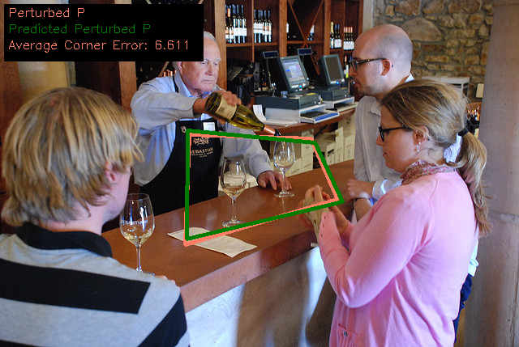 |  | | 

The pre-trained model is uploaded [here](https://drive.google.com/file/d/1ZnmlPu1NeXXMk6NHiP7fegzXM117eb15/view?usp=sharing).
# Dataset 

I used MS-COCO dataset as described in the paper. You can download it from [here](https://cocodataset.org/#download).
There are 118287 images in the train set, and 40670 in the test set. 
## Pre-processing the dataset.
Resize all images in the train and validation sets to the size of 320x240 and resize all images in the test to the size of 640x480.
Because I wanted to speed up the train progress, I then combined the resized images in train, validation and test sets into HDF5 files. For more detail, please take a look at the **Dataset.py** in the **models** directory. 

# Training
The model was trained over 49 epochs. 
The initial learning rate is 0.005, and it is divided by 10 per 30000 iterations.
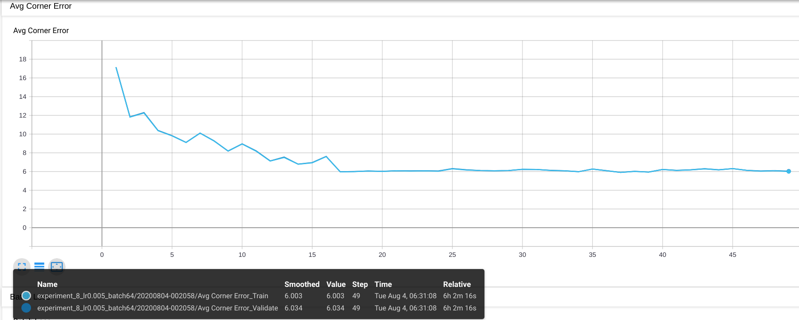
# Result
The average corner error after 49 epochs is:
1. In the train set: 6.003
2. In the validation set: 6.034

# Demo

You can run the **Demo.py** with the pre-trained model to see the predicted reusult.

``python Demo.py --image <image url>``